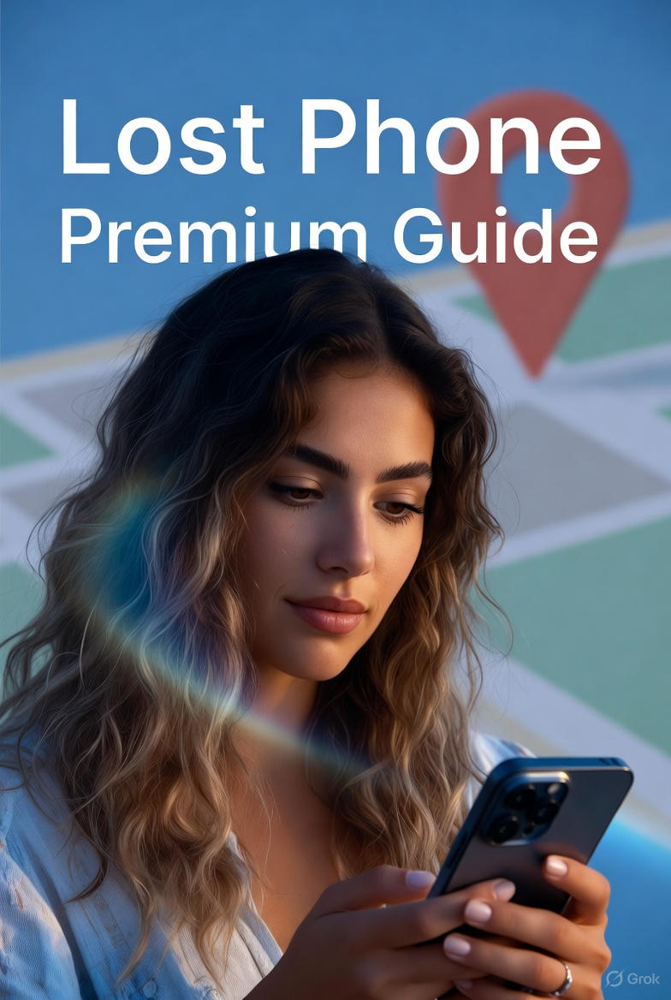

{width=100% height=100% page-break-after=always}

# Quick 1-Page Printable Checklist

**Lost Phone Emergency Checklist**

- ☐ **Step 1:** Check Find My (iPhone: icloud.com/find | Android: google.com/android/find)
- ☐ **Step 2:** Play Sound to locate phone nearby
- ☐ **Step 3:** Activate Lost Mode (iPhone) or Secure Device (Android)
- ☐ **Step 4:** Erase device remotely (only if stolen/moving location)
- ☐ **Step 5:** Call carrier to suspend service and block IMEI
- ☐ **Step 6:** If phone not found, review recent locations and check again in 5-10 minutes
- ☐ **Step 7:** Change Apple ID/Google password, email password, banking passwords
- ☐ **Step 8:** Call carrier to add Port Freeze/Number Lock and account PIN
- ☐ **Step 9:** Watch for scams — never pay tracking sites, never trust fake recovery texts
- ☐ **Step 10:** Review account security, enable 2FA everywhere, bookmark this guide

---

# Full 10-Step Guide

## Step 1: Secure your immediate safety

Find My is the fastest way to locate a missing phone. Whether you use iPhone or Android, check this first.

**If you have an iPhone:**

- Go to icloud.com/find or open the Find My app on another Apple device.
- Sign in with the same Apple ID used on your missing iPhone.
- Select your iPhone from the list.
- If a location appears, you'll see it on the map instantly.
- If it's offline, you'll still see the last known location, which gives you a starting point.

**If you have an Android:**

- Go to google.com/android/find or open the Find My Device app on another phone.
- Sign in with the same Google account used on your missing device.
- Select your phone from the list.
- If it's online, you'll see its location immediately.
- If it's offline, you'll still see the last known location and the time it was last seen.

**Good to know:**

- Find My (on both platforms) updates the moment your phone reconnects to the internet or regains power — even if it was turned off earlier.
- Checking early increases your chance of seeing a live, accurate location.

---

## Step 2: Lock your phone remotely (if possible)

Sometimes your phone is closer than you think. Both iPhones and Android devices let you force a loud alert — even if the phone is on silent or vibrate.

**If you have an iPhone:**

- Go to icloud.com/find or open the Find My app.
- Select your missing iPhone.
- Tap Play Sound.
- Your phone will make a loud alert, even if it's muted or in Do Not Disturb.

**If you have an Android:**

- Go to google.com/android/find or open the Find My Device app.
- Select your missing phone.
- Tap Play Sound.
- Your device will ring at full volume for up to 5 minutes.

**Tip:**

- Walk slowly around your home, car, yard, or office while the sound is playing. Echoes can point you in the right direction.

---

## Step 3: Do NOT call or text your lost phone yet

Locking your phone remotely keeps your data safe and lets someone contact you without unlocking it. Both iPhone and Android have this feature.

**If you have an iPhone (Lost Mode):**

- Open Find My or go to iCloud.com/find.
- Select your missing iPhone.
- Tap Activate under Mark As Lost (or Lost Mode).
- Enter a phone number where someone can reach you.
- Add a short message (ex: "This phone is lost. Please call me.").

**Once activated on iPhone:**

- Your iPhone locks instantly.
- Apple Pay is disabled.
- You'll get alerts if it's turned on or found.
- Your custom message appears on the lock screen.

**If your iPhone is offline:**

- Lost Mode will activate automatically once it reconnects.

**If you have an Android (Secure Device):**

- Go to google.com/android/find or open the Find My Device app.
- Select your missing phone.
- Tap Secure Device.
- Add a phone number and an optional lock-screen message.

**Once activated on Android:**

- Your phone locks immediately.
- Google Wallet is protected.
- Your message appears on the lock screen.
- You'll get a notification if your phone is located, powered on, or comes online.

**Why this step matters:**

- Locking your phone stops anyone from accessing your apps, texts, email, photos, or saved passwords — even if they have the device in hand.

---

## Step 4: Change your most important passwords NOW

If you believe your phone was stolen or is in a place where you won't get it back, you can erase it remotely.

This protects your data — but it should be used only as a last resort.

**Important to know before erasing:**

- You cannot track your phone after it's erased (iPhone & Android).
- Your recovery message and lock screen will stay active.
- Your accounts remain protected — thieves cannot use the device.
- The device will still require your Apple ID or Google account to reactivate.

**How to erase your phone:**

**If you have an iPhone:**

- Open Find My or go to iCloud.com/find.
- Select your missing iPhone.
- Tap Erase iPhone.
- Enter your Apple ID password to confirm.

**If you have an Android:**

- Go to google.com/android/find or open the Find My Device app.
- Select your missing phone.
- Tap Erase Device.
- Sign in with your Google account to confirm.

**When should you erase it?**

- If the device was stolen and showing a suspicious or moving location.
- If it appears to be in another state, country, or unknown area.
- If tracking updates keep pointing to places you've never been.
- If police recommend wiping it for safety.

After erasing, your data is removed — but the phone stays locked and unusable.

You remain the rightful owner.

---

## Step 5: Suspend or wipe your phone line

Your carrier can add an extra layer of protection while you work on recovering your phone.

This applies to both iPhone and Android.

**What your carrier can do:**

- Suspend service so no one can make calls, send texts, or use your data.
- Block the phone's IMEI, preventing it from being activated on any carrier.
- Flag the device as lost or stolen in their system.
- Assist with replacement options if you have insurance or device protection.

**Who to contact:**

- **AT&T:** 800-331-0500
- **Verizon:** 800-922-0204
- **T-Mobile:** 800-937-8997
- **Spectrum Mobile:** 833-224-6603
- **Google Fi:** fi.google.com
- **Xfinity Mobile:** 888-936-4968

**Tip:**

- Ask them to block the IMEI immediately — it makes the phone unusable and worthless to thieves.

---

## Step 6: Enable Lost Mode / Erase Device (only if needed)

If your phone isn't showing up in Find My / Find My Device, or the location hasn't updated, here are the last checks you should do.

**✓ Check Find My / Find My Device again in 5–10 minutes**

- Phones sometimes reconnect to the network after a brief delay.
- A quick refresh can suddenly show a new — and accurate — location.

**✓ Ask someone nearby to call or text your phone**

- If the phone turns back on, the incoming call or message can trigger a location update in:
  - Find My (iPhone)
  - Find My Device (Android)

**✓ Review any recent places you visited**

- Phones are often forgotten in:
  - ride-shares
  - gas stations
  - stores
  - restaurants
  - gym lockers
  - parking lots
  - public restrooms

- Call or stop by any place that makes sense. Lost phones are turned in more often than people think.

**✓ If the phone appears to be moving**

- A moving location usually means the phone is in someone else's possession:
  - a rideshare driver
  - a good samaritan
  - an employee gathering lost items
  - or, in some cases, theft

- Do not attempt to recover it yourself.
- Ask authorities or the location owner to assist.

**✓ If nothing updates for hours**

- Your phone — iPhone or Android — is likely:
  - powered off
  - out of battery
  - erased
  - or in a low-signal area

- At this point, your protections come from:
  - Lost Mode / Secure Device
  - Carrier block (IMEI block)
  - Tracking history
  - Account security settings

- Your data stays protected even if someone has the physical device.

---

## Step 7: Alert your bank and freeze cards

If someone has your phone, they don't just have a device — they have a doorway into your accounts.

**Close that doorway immediately.**

**1. Change your Apple ID or Google Account password**

- This instantly signs your phone out of iCloud or Google on the lost device.
- **Apple ID:** https://iforgot.apple.com
- **Google Account:** https://accounts.google.com/signin/recovery
- This is your single most powerful move to shut down unauthorized access.

**2. Change your email password**

- Your email is the master key.
- If someone gets into it, they can reset every other account you own.
- Do this even if your email app required Face ID or a passcode — those protections disappear once someone has the physical device and SIM.

**3. Update your main banking password(s)**

- Only needed if:
  - Your banking apps were logged in, or
  - Auto-login was enabled

- If the app required Face ID / fingerprint / PIN every time, the risk is lower — but updating the password is still smart.

**4. Update passwords for any account with money or fast purchases**

- Examples:
  - Amazon
  - PayPal
  - Venmo / Cash App / Zelle
  - Credit card apps
  - Any shopping or delivery app with saved cards

- These apps are often the first targets during unauthorized access.

**5. If you reuse passwords (most people do)**

- Change that reused password everywhere you used it.
- This prevents a single exposed password from opening multiple doors.

**6. Turn on Two-Factor Authentication (2FA)**

- This is non-negotiable.
- 2FA dramatically reduces the chance that someone can access your accounts — even if they know your password.
- Turn it on for:
  - Apple ID / Google
  - Email
  - Banking
  - Major shopping and payment apps
  - Social media

**Why this step matters:**

- Most of the real damage after a lost phone doesn't come from the device being gone — it comes from what people can access through it.
- This step shuts that down.

---

## Step 8: File a police report

Your phone number is the real prize.

If someone can redirect your calls or texts, they can break into anything — banking, email, social media — even if you already changed your passwords.

**Do this immediately:**

**1. Call your carrier and add a "Port Freeze" or "Number Lock"**

- This blocks anyone from transferring your number to another SIM or carrier — a common attack called SIM swapping.

**Carrier contacts:**

- **AT&T:** 800-331-0500
- **Verizon:** 800-922-0204
- **T-Mobile:** 800-937-8997
- **Spectrum Mobile:** 833-224-6603
- **Google Fi:** https://fi.google.com/account

**Tell them clearly:**

- "I lost my phone. Please place a port freeze and SIM lock on my account immediately."

**2. Add or confirm your carrier account PIN**

- If someone knows your:
  - name
  - phone number
  - ZIP code

- …they often have enough to impersonate you with the carrier.

- A PIN stops that.

**3. Ask the carrier to add an internal note on your account**

- Have them place this exact note:
  - "Customer reported device lost — do not activate a new SIM without in-person ID verification."

- This puts a hard stop on anyone trying to seize your phone number.

**Why this matters:**

- Most major account takeovers happen not through the phone itself — but by stealing the phone number.
- This step shuts that door.

---

## Step 9: Monitor accounts for 30 days

When your phone is missing, scammers come crawling out of the woodwork.

Don't give them a single opening.

**1. Never pay any website claiming it can "track your phone"**

- No website or service can magically locate your device for a fee.
- These sites exist only to:
  - steal your money
  - steal your card info
  - disappear

- If someone promises to find your phone for a price, it's a scam. Every time.

**2. Only enter your Apple ID or Google password at these official links:**

- **iPhone:** https://icloud.com/find
- **Android:** https://android.com/find

- Nothing else is legitimate, even if the page looks identical.
- Scammers clone Apple and Google login screens with frightening accuracy.

**3. Do NOT trust texts saying "We found your phone — click here"**

- These messages are fake.
- Scammers spoof Apple, Google, and carrier alerts using:
  - stolen logos
  - fake tracking maps
  - believable wording

- If the message contains a link, assume it's a trap.

**4. If someone calls claiming to be Apple, Google, or your carrier — hang up**

- Real support teams do not call you about lost devices.
- If someone asks for:
  - your Apple ID password
  - your Google verification code
  - your carrier PIN
  - your IMEI
  - or any "security code sent to your phone"

- …it's a scam.
- Hang up immediately.

**5. Never give anyone your verification codes**

- This includes:
  - Apple ID codes
  - Google 2FA codes
  - Carrier account PINs
  - Credit card numbers

- If someone asks, they're trying to take your accounts.

**6. If someone says they "found your phone" and wants money — call the police**

- Never attempt an in-person meetup with someone demanding payment or acting suspicious.
- This protects you from:
  - robbery setups
  - intimidation
  - fake handoffs
  - dangerous situations

- Let authorities handle it.

**This step saves more people than any other.**

- Losing a phone is frustrating — but falling for a scam turns a bad day into a disaster.

---

## Step 10: If your phone is recovered

Your immediate crisis is handled. Now make sure it never turns into a nightmare again.

**1. Change your Apple ID or Google password**

- Your device is out of your hands — assume someone may try to access your accounts.
- Updating this password immediately shuts down that possibility.

**2. Review devices logged into your account**

- Remove anything you don't recognize.
- **Apple:** Settings → Your Name → Devices
- **Google:** https://myaccount.google.com/device-activity
- If a device looks unfamiliar, remove it right away.

**3. Contact your carrier again tomorrow**

- Confirm:
  - your line is still protected
  - no SIM-swap attempt was made
  - no new device was added to your account

- Carriers sometimes flag suspicious activity after the initial report — this extra call catches anything missed.

**4. Update your emergency contact info**

- Add a spouse, child, or trusted friend as a recovery contact.
- This helps if you're ever locked out of your accounts.

**5. Enable these features on your next phone (non-negotiable):**

- Find My iPhone / Find My Device
- Auto-lock: 30 seconds
- Face ID / fingerprint + a strong PIN
- Use eSIM only (reduces physical SIM theft risk)
- Strong Apple ID / Google password

- These settings turn your next device into a far harder target.

**6. Bookmark this page right now**

- You found us — the hardest part.
- Keep this guide one tap away if this ever happens again.

**7. Recommended Tools to Protect Your Next Phone**

- If you want extra peace of mind going forward, these are the exact products that help prevent lost-phone disasters — organized by device type so you know what works for you.

**For iPhone Users (Apple Devices) - Best tools for preventing future loss and speeding up recovery on iPhones.**

- **AirTag** — The most reliable tracker for iPhones. If your phone goes missing again, you'll see its last known location instantly through Find My. [Buy Apple AirTag here](https://amzn.to/4rL89t6)
- **AirTag-Compatible Phone Case** — A protective case with a built-in AirTag slot so you never forget the tracker at home. [Buy AirTag-Compatible iPhone Case here](https://amzn.to/4oIuSTY)
- **AirTag Keychain / Luggage Holder** — Great for wallets, bags, backpacks, and anything else you want to keep tabs on. [Buy AirTag Keychain Holder here](https://amzn.to/44fTts4)

**For Android Users - Reliable trackers and accessories that integrate smoothly with Android devices.**

- **Samsung SmartTag 2** — Works seamlessly with Samsung Galaxy devices. Lets you locate your phone or items through SmartThings Find. [Buy Samsung SmartTag 2 here](https://amzn.to/44hLxqh)
- **Tile Tracker** — A cross-platform tracker compatible with most Android phones. Perfect for keys, bags, or keeping your phone findable through the Tile app. [Buy Tile Pro Tracker here](https://amzn.to/44cioN9)

- These small upgrades make your next lost-phone situation far easier to handle — and in many cases, prevent it entirely.

---

# BONUS: Never Lose Your Phone Again

## The 5 accounts you must lock first (with direct links)

When your phone goes missing, these five accounts are the most critical to secure immediately. Lock them in this exact order:

**1. Apple ID (iPhone users) or Google Account (Android users)**

- **Why first:** This is the master key to your device. Changing this password instantly signs your phone out of iCloud/Google, cutting off access to everything.
- **Direct link:** 
  - iPhone: https://iforgot.apple.com
  - Android: https://accounts.google.com/signin/recovery

**2. Your primary email account**

- **Why second:** Email is the master key to every other account. If someone gets into your email, they can reset passwords for banking, shopping, social media — everything.
- **Direct links:**
  - Gmail: https://myaccount.google.com/security
  - Outlook/Hotmail: https://account.microsoft.com/security
  - Yahoo: https://login.yahoo.com/account/security
  - Other providers: Go to your email provider's security settings immediately

**3. Your main banking app**

- **Why third:** Financial accounts are prime targets. Even if your banking app required Face ID, change the password immediately.
- **Action:** Log into your bank's website (not the app) and change your password. Enable 2FA if you haven't already.

**4. Payment apps (Venmo, PayPal, Cash App, Zelle, Apple Pay, Google Pay)**

- **Why fourth:** These apps allow instant money transfers. Lock them down before someone can drain your accounts.
- **Action:** Log into each app's website and change passwords. Disable any auto-login features.

**5. Shopping accounts with saved payment methods (Amazon, Target, etc.)**

- **Why fifth:** Thieves often make quick purchases before you realize what's happening. Lock these accounts to prevent unauthorized orders.
- **Action:** Change passwords and review saved payment methods. Remove any cards you don't actively use.

**Pro tip:** Set up 2FA on all five of these accounts right now — even if your phone is recovered. It's the single best protection against future account takeovers.

---

## Carrier freeze script + phone numbers

Use this exact script when calling your carrier. It ensures you get the maximum protection without confusion:

**Call Script:**

> "Hi, I need to report my phone as lost or stolen. I need three things done immediately:
> 
> 1. Suspend my service so no one can make calls or use data
> 2. Block the IMEI so the device can't be activated on any carrier
> 3. Place a port freeze and SIM lock on my account to prevent number transfer
> 
> I also need you to add a note to my account that says: 'Customer reported device lost — do not activate a new SIM without in-person ID verification.'
> 
> Can you confirm all of this is done?"

**Carrier Phone Numbers:**

- **AT&T:** 800-331-0500
- **Verizon:** 800-922-0204
- **T-Mobile:** 800-937-8997
- **Spectrum Mobile:** 833-224-6603
- **Google Fi:** 800-746-4899 (or visit fi.google.com)
- **Xfinity Mobile:** 888-936-4968
- **Cricket Wireless:** 800-274-2538
- **Metro by T-Mobile:** 888-863-8768
- **Boost Mobile:** 833-502-6678
- **US Cellular:** 800-835-2267

**What to have ready:**

- Your account number (found on your bill or in your account settings)
- The last 4 digits of your Social Security Number (for verification)
- Your account PIN (if you set one)
- The phone number associated with the lost device

**If they ask for your IMEI:**

- You can find it on your original phone box, in your account settings online, or in your phone's settings (if you have access to another device on the same account).

---

## My exact 2025 prevention setup (AirTag, case, etc. — leave placeholders for Amazon affiliate links)

After losing my phone and going through the recovery process, I built a prevention system that makes losing a phone nearly impossible. Here's my exact setup:

**For iPhone Users:**

**1. Apple AirTag (4-pack)**
- Attach one to your keys, one in your wallet, one in your bag, and keep one as a backup.
- The Find My network has over a billion devices — your AirTag will update its location constantly.
- [Buy Apple AirTag 4-Pack here](https://amzn.to/4oL5Vrh)

**2. AirTag-Compatible Phone Case**
- I use a case with a built-in AirTag slot. This ensures the tracker is always with my phone, not forgotten at home.
- Look for cases that are MagSafe compatible and have a secure AirTag holder.
- [Buy AirTag-Compatible iPhone Case here](https://amzn.to/4oIuSTY)

**3. AirTag Keychain Holder**
- For keys, wallets, and bags. The keychain design makes it easy to attach and hard to lose.
- [Buy AirTag Keychain Holder here](https://amzn.to/44fTts4)

**4. Screen Protector + Strong Case**
- A good case and screen protector won't prevent loss, but they'll protect your phone if it falls — and a protected phone is less likely to break and become unusable.

**5. Find My iPhone Settings Checklist:**
- ✅ Find My iPhone: ON
- ✅ Find My Network: ON
- ✅ Send Last Location: ON (sends location when battery is critically low)
- ✅ Auto-lock: 30 seconds
- ✅ Face ID + 6-digit passcode
- ✅ eSIM only (no physical SIM card)

**For Android Users:**

**1. Samsung SmartTag 2 (Samsung users) or Tile Pro (all Android)**
- Samsung SmartTag 2 integrates seamlessly with Galaxy devices through SmartThings Find.
- Tile Pro works with any Android phone and has a loud ring and long battery life.
- [Buy Samsung SmartTag 2 here](https://amzn.to/44hLxqh)
- [Buy Tile Pro Tracker here](https://amzn.to/44cioN9)

**2. Phone Case with Tracker Slot**
- Similar to iPhone cases, Android cases with built-in tracker slots ensure your tracker is always attached.

**3. Tile Keychain or Wallet Card**
- For keys and wallets. The Tile Wallet Card is thin enough to fit in any wallet without bulk.
- [Buy Tile Keychain here](https://amzn.to/4ptE7c2)
- [Buy Tile Wallet Card here](https://amzn.to/4ptE7c2)

**4. Screen Protector + Strong Case**
- Protection against drops means your phone stays functional longer.

**5. Find My Device Settings Checklist:**
- ✅ Find My Device: ON
- ✅ Location: ON
- ✅ Auto-lock: 30 seconds
- ✅ Fingerprint + strong PIN
- ✅ eSIM only (if supported by your carrier)

**Universal Prevention Tips:**

**1. Set up a recovery contact**
- iPhone: Settings → Your Name → Password & Security → Account Recovery
- Android: Google Account → Security → Recovery Phone/Email

**2. Enable "Send Last Location"**
- This feature sends your phone's location to Find My/Find My Device when the battery is critically low — giving you one last chance to see where it died.

**3. Use a password manager**
- Strong, unique passwords for every account make it harder for thieves to access your data even if they have your phone.
- Popular options: 1Password, LastPass, Bitwarden

**4. Regular backups**
- iPhone: iCloud backup (automatic)
- Android: Google backup (automatic)
- Regular backups mean you can erase a lost phone without losing your data.

## Final encouragement page

You've made it through the hardest part.

Losing a phone is stressful, overwhelming, and frustrating. But you found this guide. You're taking the right steps. You're protecting yourself.

**Remember:**

- You're not alone. Millions of people lose phones every year. You're handling it the right way.
- Every step you take makes you safer. Even if you can't recover the phone, you can protect your accounts, your identity, and your peace of mind.
- This situation is temporary. In a few days or weeks, you'll have a new phone, your accounts will be secure, and this will be a memory.
- You're smarter now. You know what to do if this ever happens again. You know how to prevent it. You're prepared.

**What to do right now:**

1. **Take a breath.** You've got this.
2. **Follow the checklist.** One step at a time. Don't skip steps.
3. **Bookmark this guide.** Keep it handy for the next 30 days as you monitor your accounts.
4. **Set up prevention.** Once you have a new phone, implement the prevention setup from the bonus section.
5. **Share this guide.** If you know someone who's lost a phone, send them this guide. Help them avoid the panic you felt.

**You're going to be okay.**

Your phone is replaceable. Your accounts are protectable. Your identity is securable.

You've taken control. That's the most important step of all.

---

\newpage

**Important Disclaimer**

This guide is provided for informational purposes only and is not professional legal, financial, or technical advice. 

The steps described are general recommendations based on publicly available best practices from Apple, Google, carriers, and security experts as of December 2025. 

Following these steps may result in permanent data loss, service changes, or other irreversible actions. Always consider your specific situation and consult official support from your device manufacturer, carrier, or law enforcement when needed.

LostPhones.com and its creators are not responsible for any loss of data, device functionality, or other outcomes that may occur from following this guide.

By using this guide, you agree that you are doing so at your own risk.

Thank you for trusting us during a stressful time. We wish you a swift and calm resolution.

\newpage

---

*Lost Phone Emergency Checklist + Permanent Protection Guide*  
*© 2025 LostPhones.com*
